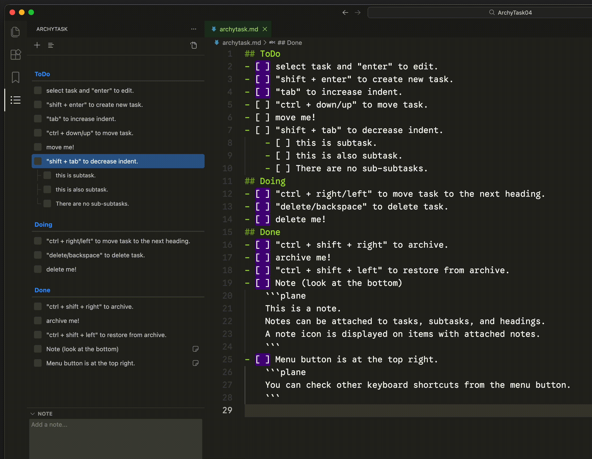

# Clean and Minimal Markdown ToDo List

ArchyTask is a todo list extension that stores your tasks in `Markdown` file. It provides a sidebar interface for creating, editing, and organizing tasks.

## How to Use

1. Open a folder or workspace
2. Click on the ArchyTask icon in the Activity Bar
3. Start adding tasks using the `+` button or keyboard shortcuts
4. Tasks are automatically saved to `archytask.md`

## Features

- **Markdown Storage & Direct Edit**: Tasks are saved in `archytask.md` in your workspace. (filename is configurable in settings) You can also edit markdown file directly in the editor.
- **Keyboard Shortcuts**: 
  - `Enter`: Edit task title
  - `Shift+Enter`: Create new task
  - `Tab/Shift+Tab`: Indent/outdent tasks
  - `Ctrl+Up/Down`: Move tasks up/down
  - `Ctrl+Shift+Right`: Archive task
- **Task Management**: Minimal task management features:
  - Headings
  - Tasks
  - Subtasks
  - Archive
- **Visual Design**: Simple, minimal UI inspired by Things.

## Requirements

VS Code 1.95.0 or higher

## License

MIT License